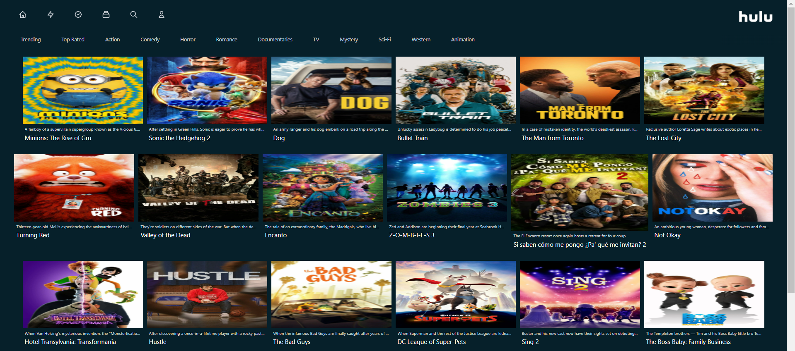
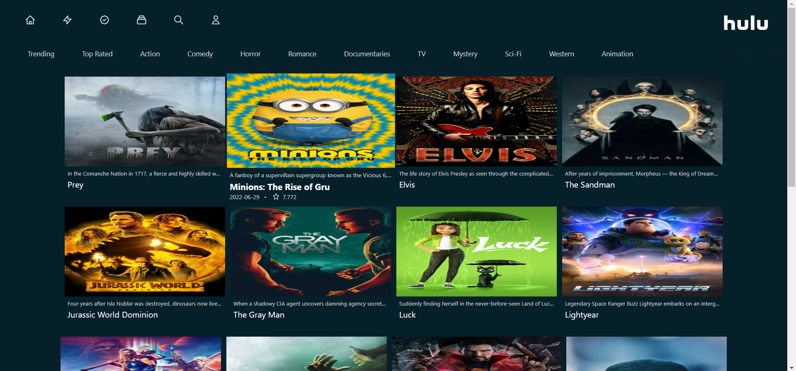
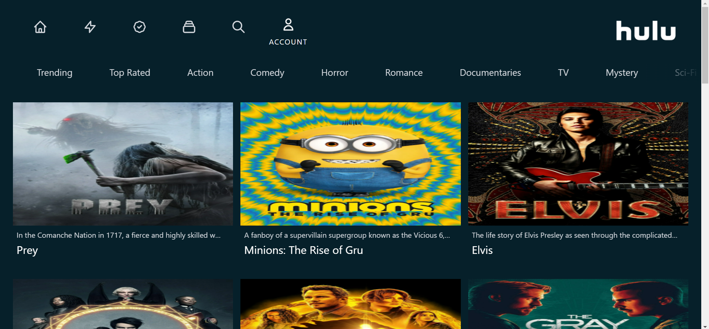
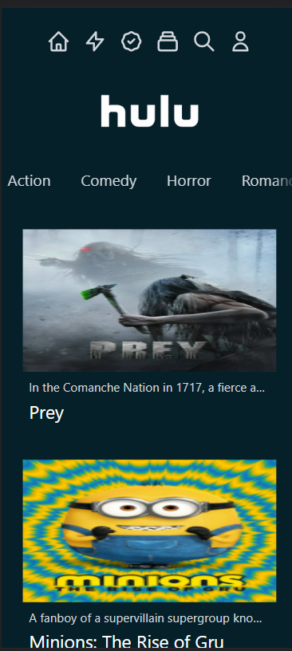
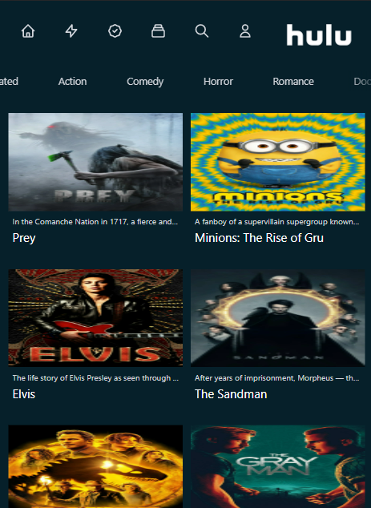

# HULU Clone

A Next.js App implementing Server Side Rendering, made using Tailwind CSS, Hero Icons, Rest API.
Extremely responsive and can switch between Flexbox and CSS Grid based on screen size.

## Deployment

You can checkout the build here.
[Website](https://hulu-clone-ruby-chi.vercel.app/)

## Screenshots

